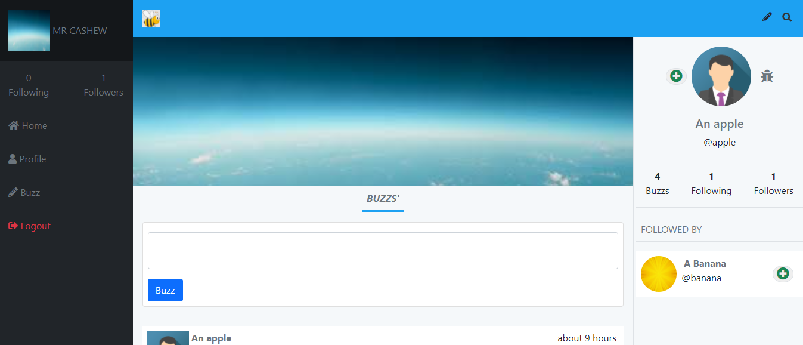
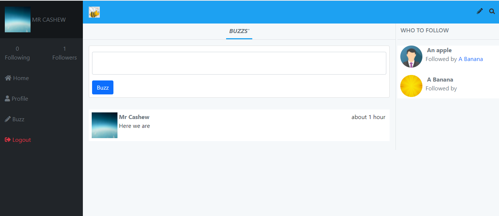

# Buzzer
## Buzzer is the next big thing. It's like twitter. You buzz, not tweet. :smiley:

> This project entails building a functional Rails application that resembles twitter. It's basically a twitter redesign. ```user```s sign-up, then they can create ```buzz```s that can be seen by other ```user```s following them. You can connect with other users by ```following``` them.





## Project Description Video

🔗 [loom](https://www.loom.com/share/43c8209d90c94e21a2245c22e29e5dfb)

## Live demo

🔗 [visit buzzer](https://rawcdn.githack.com/belsman/HTML-CSS-Captsone/df34d0f3569b8b2e60faecb02082b0f5e9a544f6/index.html)

## Built With

- Ruby 2.7
- Rails 6.0.3.4
- Postgresql
- Other tools
    - Bootstrap 4
    - Font awesome icons

## Getting Started

To get a local copy up and running follow these simple steps.

### Prerequisites

In order for ```buzzer``` to work locally on your machine, you need these installations:
- Ruby
- Postgres database engine

### Install

1) Open the Terminal
2) Run

```sh
git clone https://github.com/belsman/Rails-Capstone.git
```

or, for SSH:

```sh
git clone git@github.com:belsman/Rails-Capstone.git
```

3) Run ```cd Rails-Capstone``` to enter the main directory
4) Run ```bundle install```
5) Run ```yarn install```
6) Create database and run migrations with these command:
    - ```rails db:create```
    - ```rails db:migrate```
7) Start up the local server with ```rails s```
8) Visit ```127.0.0.1:3000```
9) Buzz and connect locally!


### Run Rails-spec

1) Open the terminal
2) Run ```cd Rails-Capstone``` to enter main directory
3) Migrate the test database: ```rails db:migrate RAILS_ENV=test```
4) Run ```rake spec```

## Author

👤 **Bello Babakolo**

- Github: [@belsman](https://github.com/belsman)
- Twitter: [@d_belsman](https://twitter.com/d_belsman)
- Linkdin: [Bello Babakolo](https://www.linkedin.com/in/bello-babakolo-b23b17145/)


## 🤝 Contributing

Contributions, issues and feature requests are welcome!

Feel free to check the [issues page](issues/).

## Show your support

Give a ⭐️ if you like this project!

## Acknowledgments

- Microverse for showing the way for this project to happen
- [Gregoire Vella on Behance](https://www.behance.net/gallery/14286087/Twitter-Redesign-of-UI-details)
- [This site for the Bee Icon](https://imgbin.com/png/WgMAZSB0/bee-png)
